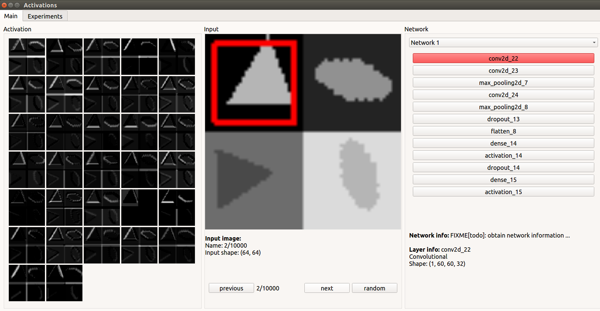

Deep Learning Toolbox (Development stage)
=========================================

A collection of tools to analyze and visualize deep neural networks.

The original goal of the toolbox was visualizing networks that solve image classifications tasks. It was motivated by the paper:

 - Jason Yosinski, Jeff Clune, Anh Nguyen, Thomas Fuchs, and Hod Lipson. [Understanding neural networks through deep visualization](http://arxiv.org/abs/1506.06579/ "Computer Science > Computer Vision and Pattern Recognition") Presented at the Deep Learning Workshop, International Conference on Machine Learning (ICML), 2015.

The main design goals are (not fully achieved yet):
* modularity: new tools can be added, building on common core functionality
* framework agnosticity: the toolbox should be able to use different neural network frameworks like TensorFlow, Torch, Caffe, ...
* clear API: the toolbox should define an interface allowing to use tools from within other programs
* comprehensive CLI: allowing to run all tools from the command line or scripts
* easy to use GUI: providing intuitive access to the tools

This is still work in progress. Below we document some aspects already
realized.

Functionality
=============

Example of a network visualization that classifies different shapes

The main window consists of activation maps for selected layer, the input and the structure of a network where the layers of interest can be chosen

Installation
============

Installation process is just installing packages listed in the requirements.txt

- python virtualenv:

  1) Install your virtualenv following [The Hitchhiker’s Guide to Python](http://docs.python-guide.org/en/latest/dev/virtualenvs/ "Virtual Environments"), check that python version >=3.6 is set as primary interpreter

  2) After activating the enviroment, run the command to install necessary libraries:

        $pip install -r requirements.txt

Support for PyTorch
-------------------

Install PyTorch.

   `$ conda install pytorch torchvision cuda80 -c soumith`

Then run the PyTorch MNIST example, tpye

   `$ python main.py --framework=torch`

Testing
=======
Run `$ pytest` to execute all tests.

Documentation
=======

Building
--------
In order to build the Sphinx documentation, `cd` into the `doc` directory and
run `make html`. Then open `build/html/index.html`. __Note__: Sphinx executes
all found modules, which can exhibit side-effects. For instance, loading
TensorFlow takes a lot of time, and so building the documentation does as well.

Adding files
--------
When adding a new python file, run ``sphinx-apidoc <folder> -o doc/source`` to
generate an `.rst` file indexing the modules. When the apidoc tool finds modules
it has already created indexes for, it will complain that those already exist.
It may be neccessary to delete them and regenerate them if you add a submodule,
I'm not currently sure.
